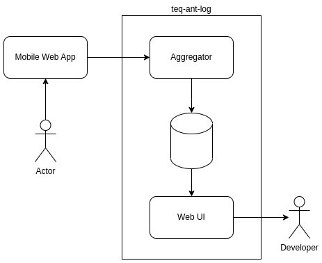
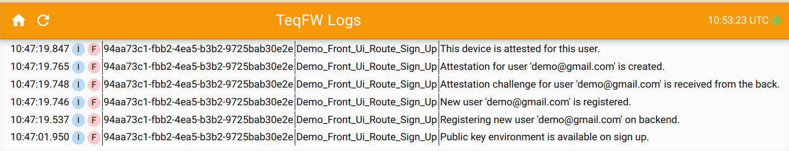

# teq-ant-log-server

The log aggregator is designed to view logs of web applications running on mobile devices. I created this aggregator
when I encountered the issue that there is no way to view the logs in the toolbar (DevTools) of Android/iPhone web
applications.

## Overview

The `Aggregator` collects all logs received from the internet and translates them in real time using
the `Web UI` SPA. The SPA does not have any restrictions and displays all logs for all users who have opened this app.



This application utilizes SSE to translate logs to any number of developers connected to the `Web UI` SPA.

## Submit Logs

```javascript
function log(message, level = 'INFO', instance = null, source = null, meta = null) {
    const entry = {
        date: new Date(),
        instance, // define front instance: 'uuidV4' for example
        level, // 'INFO|ERROR'
        message,
        meta, // additional meta-data: {'comment': 'any object converted to JSON'},
        source, // message source: './path/to/script/produces/log
        type: 'FRONT', // BACK|FRONT
    };
    navigator.sendBeacon('https://you.aggregator.com/log-agg-beacon', JSON.stringify(entry));
}
```

## View Logs

Open `https://you.aggregator.com/`:



## Setup

This app uses Knex.js to connect to PostgreSQL or MariaDB/MySQL databases.

### Create Database

#### PostgreSQL:

```
$ sudo -u postgres psql
...
postgres=# create user logs_agg password '...';
postgres=# create database logs_agg owner logs_agg;
postgres=# \q
```

#### MariaDB/MySQL:

```
root@host:/# mariadb
...
MariaDB [(none)]> CREATE DATABASE logs_agg;
MariaDB [(none)]> CREATE USER logs_agg@localhost IDENTIFIED BY '...';
MariaDB [(none)]> GRANT ALL PRIVILEGES ON logs_agg.* TO logs_agg@localhost;
MariaDB [(none)]> FLUSH PRIVILEGES;
```

## Web Requests Handler

The handler processes requests to `./log-agg-beacon/` space.